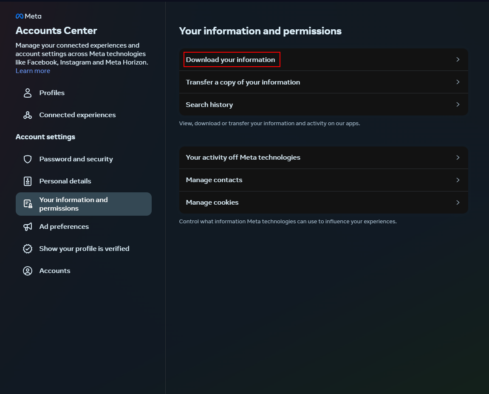
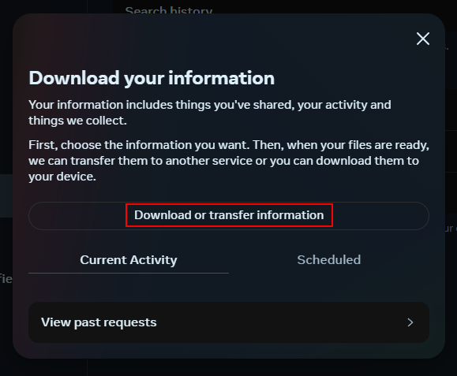
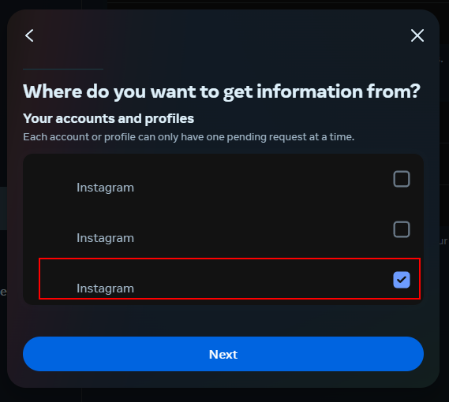
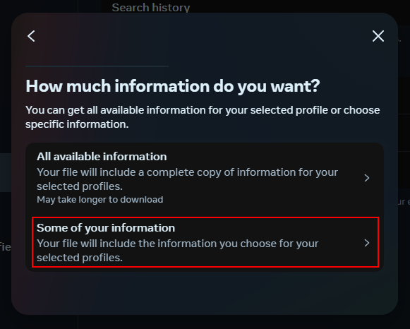
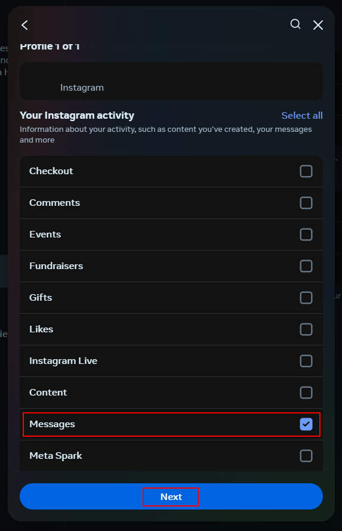
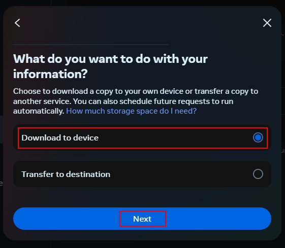
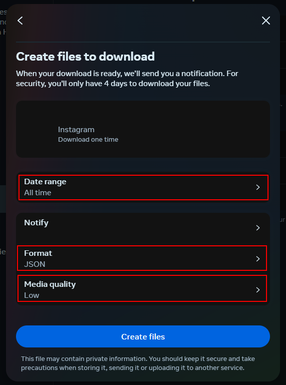
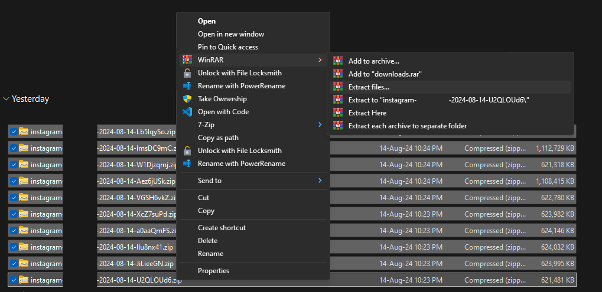

# instagram-discord-dm-analytics

## How to run

First, install requirements

```bash
pip install -r requirements.txt
```


## Downloading Instagram Data

1. Log into your instagram account at https://instagram.com
2. Go to https://accountscenter.instagram.com/info_and_permissions/
3. Click on the "Download your information" button

4. Click on "Download or transfer information"

5. Select the instagram account you want to use, and then "Next"

6. Click "Some of your information"

7. Select "Messages", and then "Next"

8. Click "Download to device" and then "Next"


9. Here you need to modify a few things.


And then click create files

After 20min-3 days you'll get an email from instagram telling you about the files being ready, there might be multiple.

Download all of the .zip  files, 


Go in the folder which contains the extracted files, it might be called `downloads`

Go to `<the-folder>\your_instagram_activity\messages\inbox`

Find the folder of the DM you want, copy it to the home directory of this repository and rename it to `instagram`.


## Downloading Discord Data

We will be using a discord chat exporter.

1. Go to https://github.com/Tyrrrz/DiscordChatExporter/releases/tag/latest
2. Scroll down, download the "DiscordChatExporter.win-x64.zip" file if you're on windows
3. Download and run the software.
4. Get your discord token and paste it there.
5. It'll show all your DMs, select the one you want and click the download button.
6. Chose an output path, Make sure the format is "CSV"

Copy the .csv file this creates into the home directory of this repository. Rename it to discord.csv
